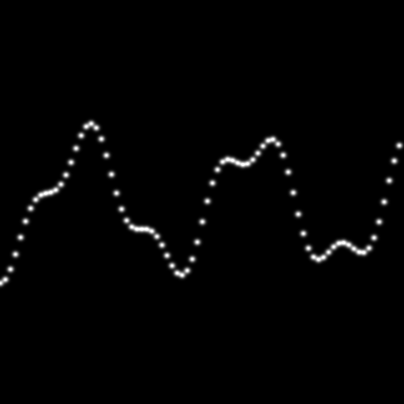
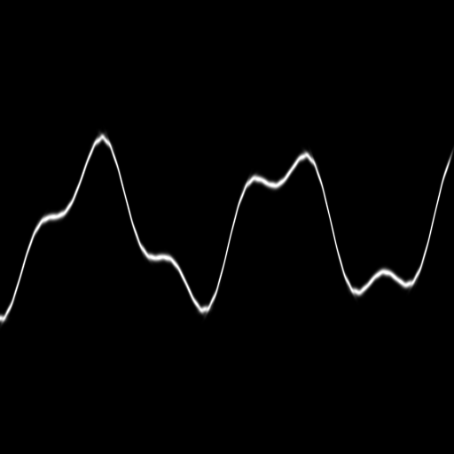

# GlitterMan

An open source implementation of "Position-Normal Distributions for Efficient Rendering of Specular Microstructure" in RenderMan, done for CIS660 at the University of Pennsylvania.

Currently, we've replicated the estimation of a heightmap normal in flatland with both flat and curved Gaussians based on the Jacobian of the normal map.

--------------
Estimation with 80 flat Gaussian elements.

Estimation with curved 60 Gaussian elements. Note the improved estimation.

--------------
We developed a GGX/Beckmann microfacet BxDF that is very similar to PxrSurface's specular reflection model. The objective of this is understanding PRMan's code with a simple problem before delving into more complicated microfacet issues.

