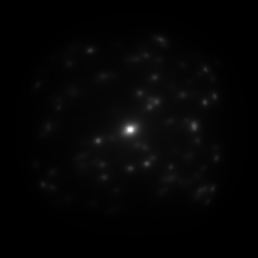

# GlitterMan

An open source implementation of "Position-Normal Distributions for Efficient Rendering of Specular Microstructure" in RenderMan, done for CIS660 at the University of Pennsylvania.

Currently, we have a naive estimator of the NDF of an arbitrary region within a normal map. The idea of the paper we'll implement is approximating this in an efficient way.

--------------

NDF of a normal map with flakes.

--------------
We developed a GGX/Beckmann microfacet BxDF that is very similar to PxrSurface's specular reflection model. The objective of this is understanding PRMan's code with a simple problem before delving into more complicated microfacet issues.

